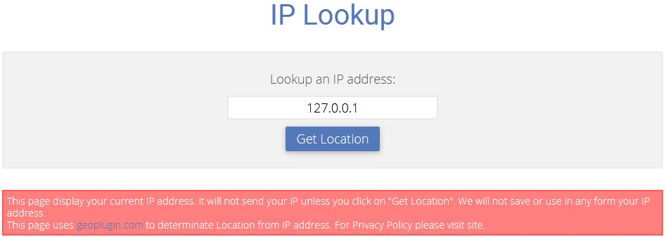

# Exopite Geo Location
## WordPress Plugin
Display IP Lookup form and enetered IP geo location with [exopite-geo-locate] shortcode.

- Author: Joe Szalai
- Version: 20191020
- Plugin URL: https://github.com/JoeSz/Exopite-Geo-Location-WordPress-Plugin
- Demo URL: https://www.joeszalai.org/ip-lookup/
- Author URL: https://www.joeszalai.org
- License: GNU General Public License v3 or later
- License URI: http://www.gnu.org/licenses/gpl-3.0.html

DESCRIPTION
-----------

This is more like a 10 min. proof of contept plugin.

```
[exopite-geo-locate service="service"]
```

Services:
* geoplugin
* freegeoip
* geobytes
* ipapi
* iplocate
* default = ipdata

Can be used with the following IP APIs, you can select them in the code.

* http://www.geoplugin.net/json.gp?ip=[IP]
* http://freegeoip.net/json/[IP]
* http://gd.geobytes.com/GetCityDetails?fqcn=[IP]
* https://ipapi.co/[IP]/json/
* https://api.ipdata.co/[IP]/
* https://www.iplocate.io/api/lookup/[IP]/

Returns if available:
* City
* State
* Country Name
* Country Code
* Continent Name
* Continent Code
* Latitude
* Longitude
* Zip Code
* Organisation

INSTALLATION
------------

1. [x] Upload `exopite-geo-location` to the `/wp-content/plugins/exopite-geo-location/` directory

OR

1. [ ] ~~Install plugin from WordPress repository (not yet)~~

2. [x] Activate the plugin through the 'Plugins' menu in WordPress


SCHREENSHOTS
------------

 

REQUIREMENTS
------------

Server

* WordPress 4.0+ (May work with earlier versions too)
* PHP 5.3+ (Required)

Browsers

* Modern Browsers
* Firefox, Chrome, Safari, Opera, IE 10+
* Tested on Firefox, Chrome, Edge, IE 11

CHANGELOG
---------

= 20191020 =
* Clean up (Remove admin interface)

= 20181123 =
* Add plugin upgrade notification.

= 20180415 =
* Fix updater location.

= 20180330 =
* Initial release.

LICENSE DETAILS
---------------
The GPL license of Exopite SEO Core grants you the right to use, study, share (copy), modify and (re)distribute the software, as long as these license terms are retained.

DISCLAMER
---------

NO WARRANTY OF ANY KIND! USE THIS SOFTWARES AND INFORMATIONS AT YOUR OWN RISK!
[READ DISCLAMER.TXT!](https://joe.szalai.org/disclaimer/)
License: GNU General Public License v3

[](http://forthebadge.com) [](http://forthebadge.com)
